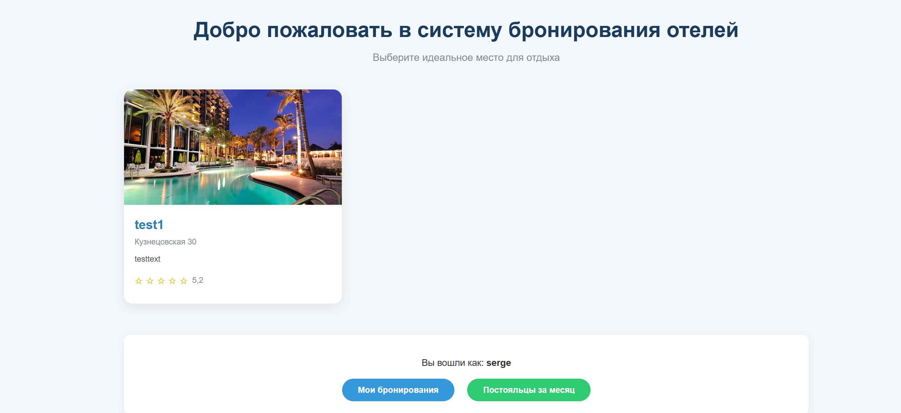

# РЕАЛИЗАЦИЯ ПРОСТОГО САЙТА СРЕДСТВАМИ DJANGO

## Цель
Овладеть практическими навыками и умениями реализации web-сервисов средствами Django 2.2.

## Практическое задание
Реализовать сайт используя фреймворк Django 3 и СУБД PostgreSQL\*, в соответствии с вариантом задания лабораторной работы.

**Вариант:** 1 (по списку 7)  

**Список отелей**  
Необходимо учитывать название отеля, владельца отеля, адрес, описание, типы
номеров, стоимость, вместимость, удобства.
Необходимо реализовать следующий функционал:  
 - Регистрация новых пользователей.  
 - Просмотр и резервирование номеров. Пользователь должен иметь возможность редактирования и удаления своих резервирований.  
 - Написание отзывов к номерам. При добавлении комментариев, должны сохраняться период проживания, текст комментария, рейтинг (1-10), информация о комментаторе.  
 - Администратор должен иметь возможность заселить пользователя в отель и
выселить из отеля средствами Django-admin.  
 - В клиентской части должна формироваться таблица, отображающая постояльцев отеля за последний месяц.

## Решение

### Структура проекта

```
lr_2/                                      
│
├── config/                               
│   ├── __init__.py
│   ├── asgi.py
│   ├── settings.py
│   ├── urls.py
│   └── wsgi.py
│
├── hotels/                                
│   ├── istockphoto-1199926339-612x612.jpg
│   ├── бобик_ультиматив.png
│   └── отель1.jfif
│
├── hotelsales/                            
│   ├── __init__.py
│   ├── admin.py
│   ├── apps.py
│   ├── forms.py
│   ├── models.py
│   ├── tests.py
│   ├── urls.py
│   ├── views.py
│   │
│   ├── migrations/
│   │   ├── __init__.py
│   │   ├── 0001_initial.py
│   │   ├── 0002_booking_adults_booking_children.py
│   │   ├── 0003_alter_booking_check_in_alter_booking_check_out_and_more.py
│   │   ├── 0004_hotel_photo_alter_booking_total_price_and_more.py
│   │   
│   │
│   └── templates/
│       └── hotelsales/
│           ├── add_review.html
│           ├── booking_form.html
│           ├── edit_booking.html
│           ├── home.html
│           ├── hotel_detail.html
│           ├── my_bookings.html
│           ├── recent_guests.html
│           └── register.html
│
├── db.sqlite3                             
├── manage.py                              
└── .gitignore
```

### Модели:
**Hotel** — отели (название, владелец, адрес, описание, фото)

**RoomType** — типы номеров (название, описание, отель, стоимость за ночь, вместимость, удобства)

**Booking** — бронирования (пользователь, тип номера, даты заезда/выезда, количество взрослых/детей, общая стоимость, статус)

**Review** — отзывы (бронирование, рейтинг 1–10, комментарий, дата создания)

### Возможности системы

**Для всех пользователей (без авторизации):**
- Просмотр списка отелей
- Поиск по названию отеля
- Просмотр информации об отелях и номерах
- Просмотр отзывов о номерах
- Регистрация и вход в систему

**Для авторизованных пользователей:**
- Бронирование номеров с проверкой доступности
- Редактирование и отмена своих бронирований
- Написание отзывов после выселения
- Личный кабинет с историей бронирований

**Для персонала (администраторов):**
- Доступ к админ-панели Django
- Редактирование любых бронирований
- Просмотр всех гостей за выбранный период
- Управление статусами заселения и выселения

### Технические особенности
- В проекте используется Bootstrap для адаптивного интерфейса
- Настроена пагинация для списка отелей
- Реализован поиск по названию отеля

### Скриншоты работы сайта


**Стартовая страница**
 